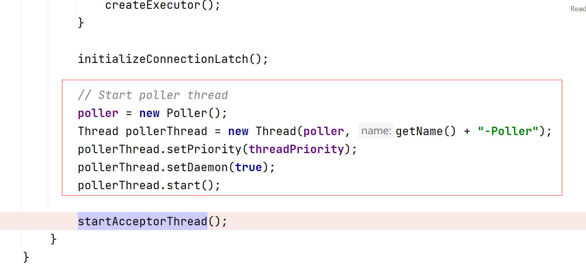
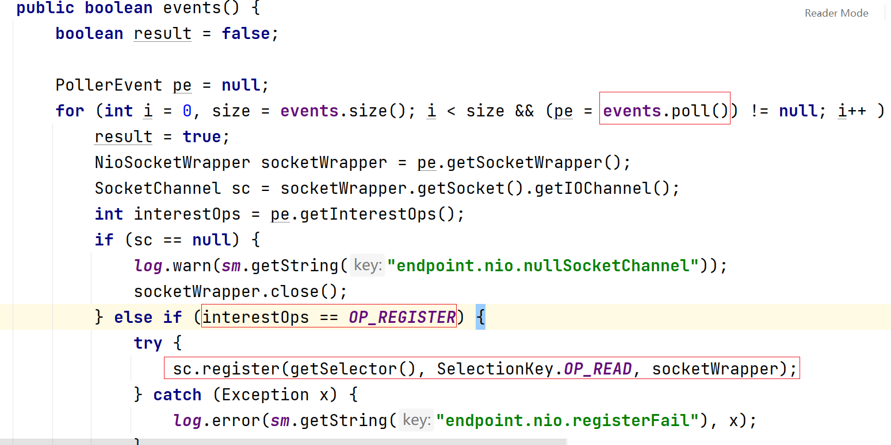

# tomcat 网络模型简易解析

### 环境

base on spring-boot-starter-web:2.6.7 embedded tomcat

### 调试入口

启动两个 `server.port` 相同的springboot应用会报端口占用的错误

我们在这个异常类的构造方法上打一个断点，这就是我们的调试入口

debug模式启动后（后面启动报错的程序），通过堆栈日志我们可以看到这个异常是由 `org.springframework.boot.web.embedded.tomcat.TomcatWebServer` 抛出的

### `TomcatWebServer`

前面我们讲到了端口占用的异常是由 `TomcatWebServer` 抛出的，我们可以从前面的堆栈图看到 `TomcatWebServer` 的 `start` 方法。

但是光看start方法好像什么都看不出来，也是无从下手，除非每一个方法debug进去看一下。其实这里还是得回到 `PortInUseException` ，我们看一下它的 `stackTrace` ：

它的 `stackTrace` 栈最顶部帧是 `org.apache.catalina.core.StandardService.addConnector`

我们看一下这个方法：

很明显我们应该从 `connector.start()` 入手

继续看一下 `startInternal()` 方法：

沿着图片红圈的路径一直走：

我们终于看到与网络模型有关的 `bind()` 了

上面的路径如果还是觉得无从入手，也是可以通过查看异常 `stackTrace` 解决的，比如在 `org.apache.catalina.core.StandardService.addConnector` 时：

### 监听

因为tomcat默认使用的是 `org.apache.tomcat.util.net.NioEndpoint` ，我们来看一下它的 `bind`  方法

第一行很明显是初始化 `ServerSocket` ，我们进去看看：

果然发现了 `ServerSocket` 的绑定，但是注意这里还有个 `getAcceptCount()` 方法，通过查看源码可以得知，该方法设置的是**backlog，并且它在tomcat中的默认值为100**（backlog是指一个决定内核为服务端socket维护的队列的容量的参数，连接队列是指操作系统为服务端socket维护的用于保存等待被服务端socket调用取走的队列）

回到 `org.apache.tomcat.util.net.AbstractEndpoint.start()`方法 ，我们看一下 `org.apache.tomcat.util.net.NioEndpoint.startInternal` 方法的执行：

前面设置一些属性就不仔细看了， `Poller` 这部分后面再讲，我们来看 `org.apache.tomcat.util.net.AbstractEndpoint.startAcceptorThread` 方法：

这里我们可以看到启动了**一个监听线程** ，我们继续看一下 `Acceptor` 的实现，因为它是一个 `Runnable` ，我们主要来看它的 `run` 方法

首先正常情况下，监听线程会无线循环执行里面的逻辑

其次达到最大连接数时，线程会等待

并且可以得知**最大连接数是8192**

然后线程会调用 `ServerSocket` 的accept

**这里的accept是直接阻塞的，不是像其它的一些模型一样是等探测到 `OP_ACCEPT` 事件后才accept**

我们这时触发客户端连接，可以发现**在`Acceptor` 线程的 `run` 方法的这一步与 `Poller` 线程产生了交互**

`Acceptor` 线程向 `Poller` 线程注册了这个socket，并产生了读事件存放到事件队列中

### IO监听

现在目光回到 `org.apache.tomcat.util.net.NioEndpoint.startInternal`

上图红圈处创建了**一个IO监听线程**， `Poller` 也是一个 `Runnable` ，同样我们也是从它的 `run` 方法入手

上面红圈中的 `events` 方法会判断是否有读事件发生

上面红圈中的 `events` 是一个存放事件的队列，而 `events` 方法会对队列中的事件进行遍历，如果是读事件就把 `Channel` 注册到 `Selector` 中。我们回到 `Poller` 的 `run` 方法

上图是在计算有几个socket是满足条件的，然后 `Poller` 线程会对满足条件的socket进行遍历处理

在处理socket时， `Poller` 线程首先会把当前socket从 `Selector` 中取消注册，如果是可读的话，会把当前socket抛给业务线程池 `Executor` 进行处理

### IO读

还是回到 `org.apache.tomcat.util.net.NioEndpoint.startInternal` 方法

其实在创建 `Poller` 线程前，业务线程池也被创建了，这里有几个线程池的参数挺重要的

**核心线程数 `corePoolSize` 默认值为10，最大线程数 `maximumPoolSize` 默认值为200**

前面我们提到过 `Poller` 线程会把当前socket抛给业务线程池，我们来看一下：

这里可以看到 `Poller` 线程把 `org.apache.tomcat.util.net.SocketProcessorBase` 提交给了线程池，查看 `SocketProcessorBase` 的源码可以知道它是一个 `Runnable` ，所以业务线程池的执行我们从它的 `run` 方法入手

其实到这里之后，就已经挺难判断哪里才是我们应该看的地方了，但是我们可以通过 `SocketWrapperBase` 这个类入手，因为它被作为参数传递给了 `org.apache.coyote.AbstractProtocol.ConnectionHandler.process` 。这里 `SocketWrapperBase` 的实际类型很容易可以得知是 `org.apache.tomcat.util.net.NioChannel` 类型的（通过查看是谁调用 `SocketWrapperBase` 的构造方法得知）

所以我们不妨在 `NioChannel` 的 `read` 方法上打一个断点

这表明**tomcat nio 网络模型的IO读是在业务线程池完成的**

### IO写

业务逻辑的执行自然是在业务线程池，IO写我们同样可以在 `NioChannel` 的 `write` 方法打一个断点

这证明了**tomcat nio 网络模型的IO写是在业务线程池完成的，并且与IO读、业务逻辑处理是同一个线程**

### http长连接

我们知道对于http长连接，一次长连接可能包含多个http请求，而 `Poller` 线程会监听存放事件的队列里的读事件，所以我们可以在存放事件的队列的地方打一个断点（ `org.apache.tomcat.util.net.NioEndpoint.Poller.addEvent` ）

发送请求后可以发现有两个线程调用此处：

